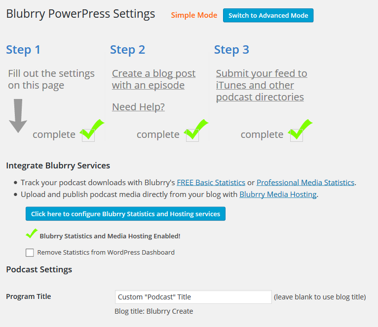
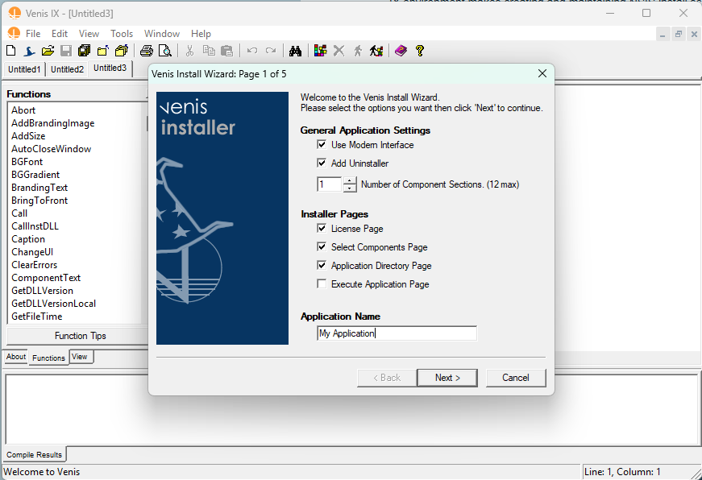
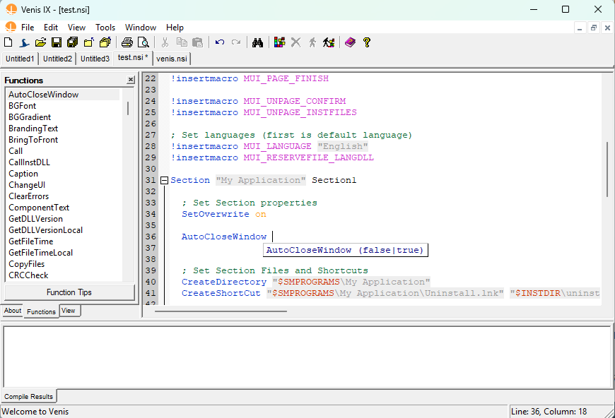
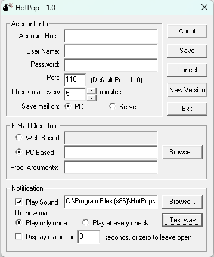
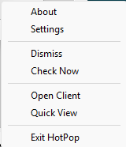
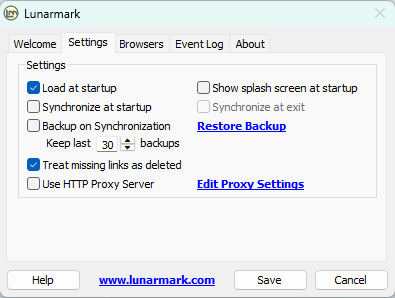

# portfolio

Portfolio of Angelo's Personal Projects

## Analytics projects

### Datacenter and Cloud Service Lists

A GitHub auto-updating repository, GitHub actions run daily to maintain a list of datacenters and Cloud service providers.

Link: [https://github.com/painlessanalytics/datacenter-cloud-ip-lists](https://github.com/painlessanalytics/datacenter-cloud-ip-lists)

### Update Geo IPs Serverless Application

An AWS Lambda function serverless application written in Golang that maintains a Maxmind database of over 100 million datacenters, cloud service providers, and VPNs.

Link: Not public

### Logger Server

A custom built Nginx server with built-in server side JavaScript. Server designed to efficiently log web beacon events and removes privacy information that would otherwise be logged.

Link: Not public

### Painless Analytics Tracker

An IIFE page event tracking privacy focused JavaScript, measures user engagement.

Link: Not available (coming soon)

## WordPress projects

### FrontPup WordPress Plugin
A CloudFront tool to optimize page caching headers and easily clear site cache.

FrontPup WordPress plugin welcome screen:

FrontPup WordPress plugin cache settings:

Link: [https://www.wordpress.org/plugins/frontpup/](https://www.wordpress.org/plugins/frontpup/)

### Canonical Pages WordPress Plugin

A WordPress plugin that allows you to quickly enable, customize, or disable the canonical meta tag on your pages. Yoast SEO, Rank Math, and All in One SEO plugins are supported.

Example of Canonical Pages WordPress plugin settings:

Link: [https://www.wordpress.org/plugins/canonical-pages/](https://www.wordpress.org/plugins/canonical-pages/)

### Painless Analytics WordPress Plugin

A WordPress plugin that makes it easy to link your Painless Analytics account to your WordPress website and add the Painless Analytics Tracker to your web pages.

Example of Painless Analytics WordPress plugin settings:

Link: [https://www.wordpress.org/plugins/painless-analytics/](https://www.wordpress.org/plugins/painless-analytics/)

### HTML Page Sitemap

A simple web page site map (not XML).

Example of HTML page sitemap:

Link: [https://www.wordpress.org/plugins/html-sitemap/](https://www.wordpress.org/plugins/html-sitemap/)

### PowerPress WordPress Plugin

PowerPress is a podcasting plugin for WordPress. It provides an easy way to publish podcasts and manage podcast feeds.

PowerPress getting started steps:

Edit Episode screen:

Link: [https://www.wordpress.org/plugins/powerpress/](https://www.wordpress.org/plugins/powerpress/)

## Windows Applications

From 2000 to 2010 I developed a number of Windows applications, some of which are still available for download.

### PingLookup

Network ping and domain name service lookup tool.

Link: [https://www.spaceblue.com/products/pinglookup/](https://www.spaceblue.com/products/pinglookup/)

### PDF Blender

A PDF merge and password protection application that utilizes Ghostscript.

PDF Blender is written in C++ using the wxWidgets. Last release was in April 2005.

Link: [https://www.spaceblue.com/products/pdfblender/](https://www.spaceblue.com/products/pdfblender/)

### Visual Environment for Nullsoft Install System - Installer eXtreme (Venis IX)

Venis IX environment makes creating and maintaining NSIS install scripts quick and easy. Features include a visual editor, script debugging, and a built in NSIS compiler. 

- Keyword API tips
- Function and Section folding Updated
- Compiler goto error support
- Multiple document interface
- Advanced open files toolbar
- Drag and drop function wizards Updated
- Load and save session support
- Reload last opened files support
- NSIS Install Wizard
- Advanced F1 help opens the official nsis.chm
- Check for NSIS and Venis IX updates
- Faster compiler results
- Function/Section View Improved
- Modern UI variables

Create Script Wizard

Editor Tool Tip

Drag and Drop Function Wizard - CopyFiles Example

Venis is written in C++ using wxWidgets and features the Scintilla code editor component. Venis IX last release was in January, 2009 and is now available as freeware.

Link: [https://www.spaceblue.com/products/venis/](https://www.spaceblue.com/products/venis/)

### HotPop E-mail Notification

HotPop was a client program that can check a users pop E-mail account and notify them of new email. It runs in the system tray and can be configured to check accounts at user defined intervals.

Written in C++ using the Microsoft Foundation Classes (MFC) library.

Internet Archive Link: [https://web.archive.org/web/20040803130027/http://www.spaceblue.com/hotpop/](https://web.archive.org/web/20040803130027/http://www.spaceblue.com/hotpop/)

### Lunarmark

Lunarmark was the program to synchronize your bookmarks between multiple browsers any time you wanted. It made managing your bookmarks easy and efficient.

Lunarmark supported up to Internet Explorer 5, Netscape (all versions), and Firefox 2.x. Subsequent versions of browsers have made it difficult to maintain bookmark synchronization from outside of the applications, which made Lunarmark obsolete. Lunarmark would synchronize bookmarks found in the bookmarks.html of each Mozilla based browser and the bookmarks folders of Internet Explorer.

Developed in C++ with wxWidgets, featured SQLite database and web links within the application. Last release was in April 2005.

Internet Archive Link: [https://web.archive.org/web/20060610153808/http://lunarmark.com/](https://web.archive.org/web/20060610153808/http://lunarmark.com/)

## Open Source Community contributions

Coming soon!

