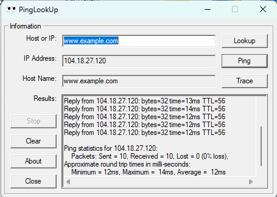
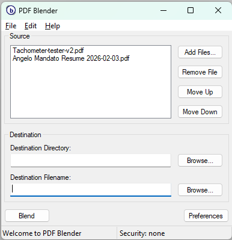
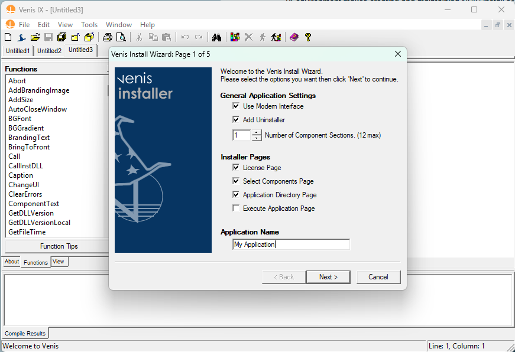
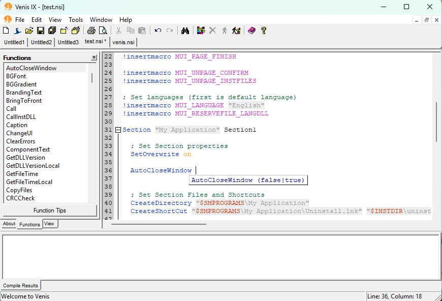
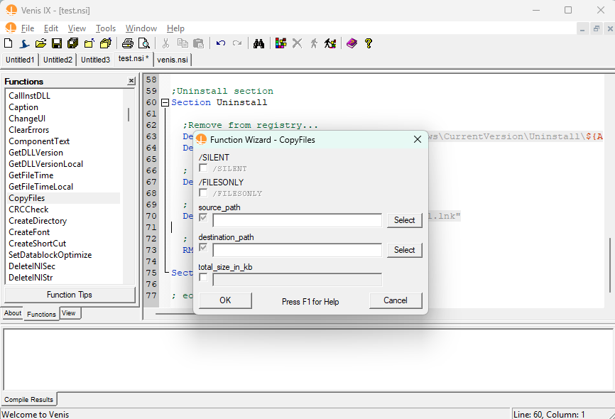
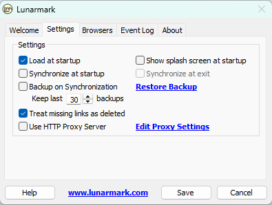
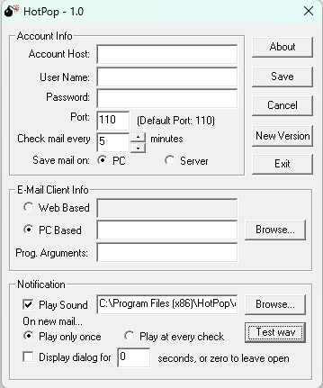
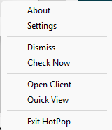

# Windows Applications by Angelo Mandato

Since 2000 Angelo Mandato has developed a number of Windows applications.

Early applications were written in C++ using the Microsoft Foundation Classes (MFC) library. Later applications were written in C++ using the wxWidgets library, which allowed for cross platform development. Some of these applications are still available for download and are listed below.

## wxWidgets Applications

From 2002 to 2010 Angelo Mandato developed a number of Windows applications, some of which are still available for download.

### PingLookup v2.x

Network ping and domain name service lookup tool.

Link: [https://www.spaceblue.com/products/pinglookup/](https://www.spaceblue.com/products/pinglookup/)

### PDF Blender

A PDF merge and password protection application that utilizes Ghostscript.

PDF Blender is written in C++ using the wxWidgets. Last release was in April 2005.

Link: [https://www.spaceblue.com/products/pdfblender/](https://www.spaceblue.com/products/pdfblender/)

### Visual Environment for Nullsoft Install System - Installer eXtreme (Venis IX)

Venis IX environment makes creating and maintaining NSIS install scripts quick and easy. Features include a visual editor, script debugging, and a built in NSIS compiler. 

- Keyword API tips
- Function and Section folding Updated
- Compiler goto error support
- Multiple document interface
- Advanced open files toolbar
- Drag and drop function wizards Updated
- Load and save session support
- Reload last opened files support
- NSIS Install Wizard
- Advanced F1 help opens the official nsis.chm
- Check for NSIS and Venis IX updates
- Faster compiler results
- Function/Section View Improved
- Modern UI variables

Create Script Wizard

Editor Tool Tip

Drag and Drop Function Wizard - CopyFiles Example

Venis is written in C++ using wxWidgets and features the Scintilla code editor component. Venis IX last release was in January, 2009 and is now available as freeware.

Link: [https://www.spaceblue.com/products/venis/](https://www.spaceblue.com/products/venis/)

### Lunarmark

Lunarmark was the program to synchronize your bookmarks between multiple browsers any time you wanted. It made managing your bookmarks easy and efficient.

Lunarmark supported up to Internet Explorer 5, Netscape (all versions), and Firefox 2.x. Subsequent versions of browsers have made it difficult to maintain bookmark synchronization from outside of the applications, which made Lunarmark obsolete. Lunarmark would synchronize bookmarks found in the bookmarks.html of each Mozilla based browser and the bookmarks folders of Internet Explorer.

Developed in C++ with wxWidgets, featured SQLite database and web links within the application. Last release was in April 2005.

Internet Archive Link: [https://web.archive.org/web/20060610153808/http://lunarmark.com/](https://web.archive.org/web/20060610153808/http://lunarmark.com/)

### Blubrry Podcast Media Uploader

The Blubrry Podcast Media Uploader was a tool to upload media files to podcast hosting provider *Bluibrry Podcasting*. The application used the Blubrry Podcasting API to allow for uploading media files and manage podcast episodes. It utilized the wxWidgets library for the user interface and was written in C++. The application is no longer available for download.

### wxCode Library Contributions

I contributed a number of classes to the wxCode library, which is a collection of C++ classes and tools for use with the wxWidgets library. Some of these classes include:

* [wxHyperlinkCtrl](https://sourceforge.net/projects/wxcode/files/Components/hyperlink/) - A control that displays a hyperlink and can be clicked to open the link in a web browser (this control is now part of wxWidgets).
* [wxHTTPEngine](https://sourceforge.net/projects/wxcode/files/Components/wxHTTPEngine/) - A collection of classes to handle HTTP requests and responses, including support for cookies and multipart form data.

## MS Visual C++ using MFC Applications

### HotPop E-mail Notification

HotPop was a client program that can check a users pop E-mail account and notify them of new email. It runs in the system tray and can be configured to check accounts at user defined intervals.

Written in C++ using the Microsoft Foundation Classes (MFC) library.

Internet Archive Link: [https://web.archive.org/web/20040803130027/http://www.spaceblue.com/hotpop/](https://web.archive.org/web/20040803130027/http://www.spaceblue.com/hotpop/)

### PingLookup v1.x

Network ping and domain name service lookup tool, version 1.x was written in C++ using the Microsoft Foundation Classes (MFC) library..

PingLookup was rewritten using wxWidgets in 2002 and is still available for download (see above).
