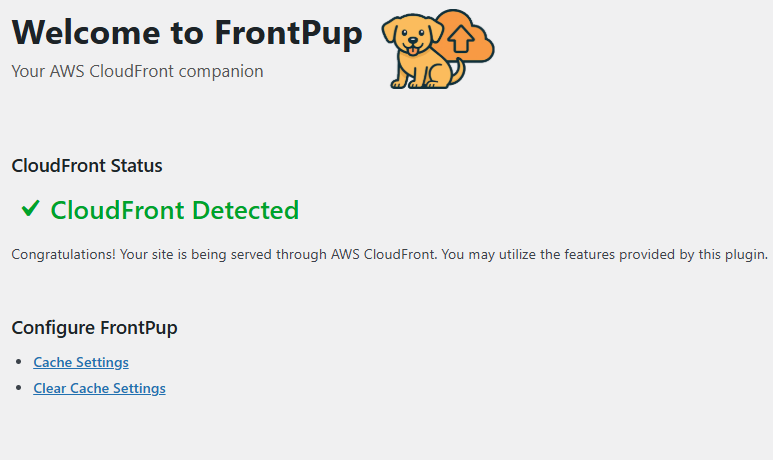
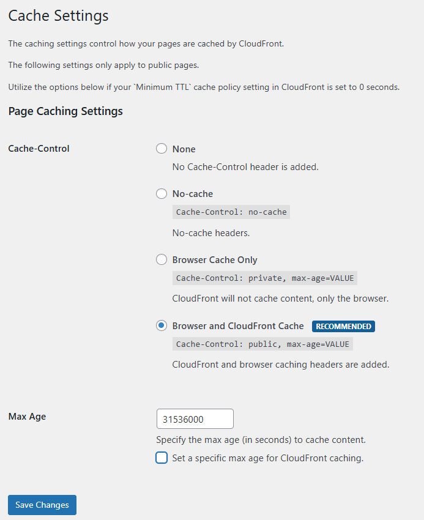
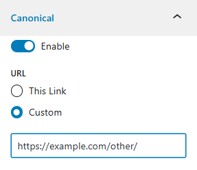
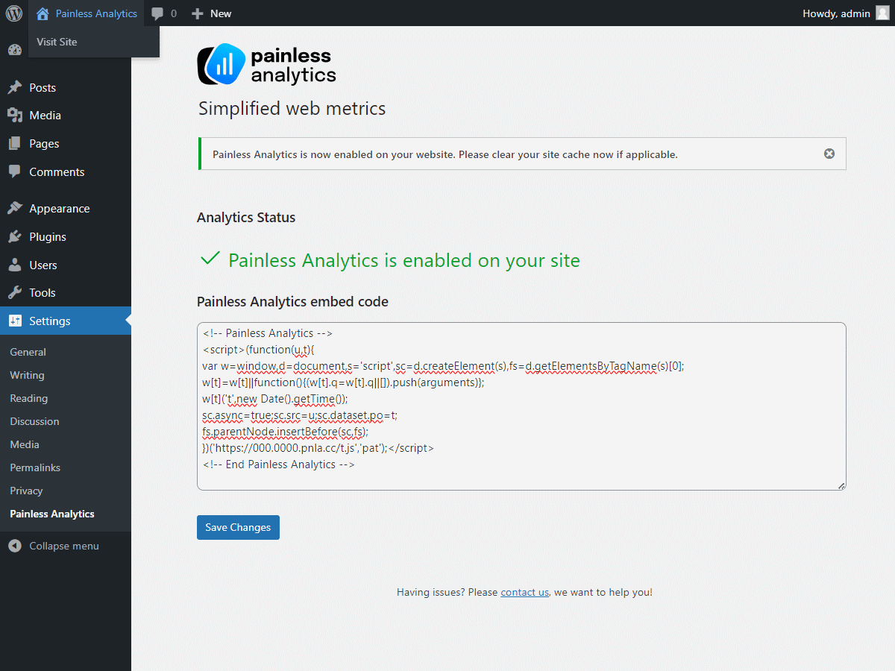
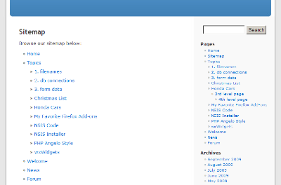
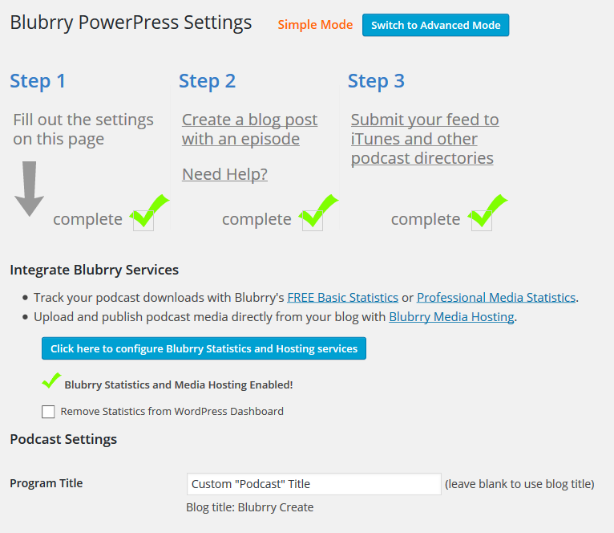
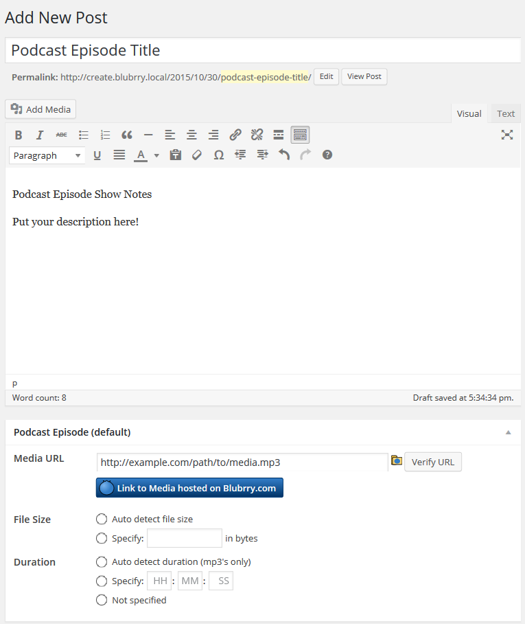

# WordPress including Themes, Plugins, and Contributions by Angelo Mandato

Since 2005 Angelo Mandato has developed a number of WordPress sites, themes, and plugins, some of which are still available for download.

## WordPress Plugins

Angelo Mandato has developed a number of custom WordPress plugins for clients and personal projects that are not available for download. Some of these plugins are listed below.

### **FrontPup WordPress Plugin**
A CloudFront tool to optimize page caching headers and easily clear site cache.

FrontPup WordPress plugin welcome screen:

FrontPup WordPress plugin cache settings:

Link: [https://www.wordpress.org/plugins/frontpup/](https://www.wordpress.org/plugins/frontpup/)

Code: [https://github.com/painlessanalytics/frontpup](https://github.com/painlessanalytics/frontpup)

### **Canonical Pages WordPress Plugin**

A WordPress plugin that allows you to quickly enable, customize, or disable the canonical meta tag on your pages. Yoast SEO, Rank Math, and All in One SEO plugins are supported.

Example of Canonical Pages WordPress plugin settings:

Link: [https://www.wordpress.org/plugins/canonical-pages/](https://www.wordpress.org/plugins/canonical-pages/)

Code: [https://github.com/painlessanalytics/canonical-pages](https://github.com/painlessanalytics/canonical-pages)

### **Painless Analytics WordPress Plugin**

A WordPress plugin that makes it easy to link your Painless Analytics account to your WordPress website and add the Painless Analytics Tracker to your web pages.

Example of Painless Analytics WordPress plugin settings:

Link: [https://www.wordpress.org/plugins/painless-analytics/](https://www.wordpress.org/plugins/painless-analytics/)

Code: [https://github.com/painlessanalytics/wp-plugin-painlessanalytics](https://github.com/painlessanalytics/wp-plugin-painlessanalytics)

### **HTML Page Sitemap**

A simple web page sitemap (not XML). Latest version supports the new WordPress block editor and includes a block to easily add a sitemap to any page or post.

Example of HTML page sitemap:

Link: [https://www.wordpress.org/plugins/html-sitemap/](https://www.wordpress.org/plugins/html-sitemap/)

Code: [https://github.com/mandato-wordpress/html-sitemap](https://github.com/mandato-wordpress/html-sitemap)

### **PowerPress WordPress Plugin**

PowerPress is a podcasting plugin for WordPress. It provides an easy way to publish podcasts and manage podcast feeds.

PowerPress getting started steps:

Edit Episode screen:

Link: [https://www.wordpress.org/plugins/powerpress/](https://www.wordpress.org/plugins/powerpress/)

Code: (As of May, 2022 Angelo no longer maintains this project, the code is still available on wordpress.org) [

### Other WordPress plugins

A list of other WordPress plugins Angelo created that are either no longer available or are proprietary and are not available for download.

- **Subscribe Sidebar Plugin** - A simple plugin to add a subscribe sidebar widget to your WordPress site. It supports RSS, email, and Google reader (now defunct).
- **Static Feed WordPress Plugin** - A plugin that generates a static RSS feed for your WordPress site. It was designed to be used with FeedBurner and other feed management services and replicated the same feed filename that was found in a different blogging platform called Movable Type.
- **MIDAS Assessment WordPress Plugin** - Custom WordPress plugin to integrate the MIDAS Assessment tool into a WordPress website. The plugin allows users to take the MIDAS Assessment and view their results within the WordPress site. Tied together WordPress accounts to access the survey, view results and generated PDFs of the results. The plugin also included a custom admin interface for managing the MIDAS Assessment and viewing user results.
- **Formulas WordPress Plugin** - A plugin that allowed you to easily add automotive calculators to your WordPress website including engine compression calculator.
- **DoMore WordPress Plugin** - A plugin that added a "Do More" button and added functionality when the "more" tag was used in a post. The more link was part of the older text editing experience and is no longer available with the newer WordPress block editor.

## WordPress Themes

Angelo Mandato has developed a number of custom WordPress themes for clients and personal projects that are not available for download. Some of these theme types include personal blogs, business websites, and product-focused sites.

- **WordPress Theme (with native editor)** - A number of custom WordPress themes for clients and personal projects. Some of these themes include custom page templates, custom post types, and custom taxonomies to meet the specific needs of the websites they were developed for.
- **WordPress Theme (with Elementor)** - A number of custom WordPress themes that were developed to work with popular page builders like Elementor and Beaver Builder. These themes included custom templates and styling to work seamlessly with the page builder and provide a great user experience for website visitors.
- **WordPress Theme (with Gutenberg)** - A number of custom WordPress themes that were developed to work with the newer WordPress block editor, Gutenberg. These themes included custom block styles and templates to take advantage of the new editing experience and provide a great user experience for website visitors.

## WordPress Contributions

Angelo Mandato has made a number of contributions to the WordPress community, including:

* Contributed to forum questions and support
* Contributed code to various WordPress plugins
* Contributed suggestions and feedback
* Contributed code for the JetPack plugin (was rewritten, no credit given)

## WordPress Hosting

Angelo Mandato has experience with a number of WordPress hosting providers as well as self hosting WordPress.

### WordPress Hosting Providers

Angelo Mandato has experience with a number of WordPress hosting providers including:

- **WP Engine** - A managed WordPress hosting provider that offers a range of hosting plans and features designed to optimize WordPress performance and security.
- **Kinsta** - A managed WordPress hosting provider that offers a range of hosting plans and features designed to optimize WordPress performance and security.
- **GoDaddy** - A web hosting provider that offers a range of hosting plans including shared hosting, cloud hosting, and dedicated hosting. GoDaddy also offers a range of features designed to optimize WordPress performance and security.
- **Pantheon.io** - A managed WordPress hosting provider that offers a range of hosting plans and features designed to optimize WordPress performance and security.
- **AWS Lightsail** - A cloud hosting provider that offers a range of hosting plans and features designed to optimize WordPress performance and security. AWS Lightsail provides a simple and cost-effective way to host WordPress websites in the cloud.

### Self Hosting WordPress

Angelo Mandato has experience with self hosting WordPress on a variety of platforms including:

- **AWS EC2** - Amazon Web Services Elastic Compute Cloud (EC2) is a cloud hosting platform that allows you to run virtual servers in the cloud. Angelo has experience with setting up and managing WordPress websites on AWS EC2 instances.
- **VPS Hosting** - Angelo has experience with setting up and managing WordPress websites on virtual private servers (VPS) from a variety of hosting providers. VPS hosting provides a dedicated virtual server for your WordPress website, which can offer improved performance and security compared to shared hosting.
- **Dedicated Hosting** - Angelo has experience with setting up and managing WordPress websites on dedicated servers. Dedicated hosting provides a physical server that is dedicated to your WordPress website, which can offer improved performance and security compared to shared hosting and VPS hosting.

### WordPress Web Servers

Angelo Mandato has experience with configuring WordPress to run on Apache, Lighttpd, and Nginx web servers. This includes configuring the web server to serve WordPress content, optimizing performance, and ensuring security best practices are followed.

Server technology Angelo has used with WordPress includes:

* Apache with mod_php
* Apache with PHP-FPM
* Nginx with PHP-FPM
* Lighttpd with PHP-FPM

### WordPress Apache and Nginx Stack Configuration

Angelo Mandato has experience with configuring WordPress to run on Apache with Nginx. In this configuration Apache is used to serve dynamic content and Nginx is used as a reverse proxy to serve static content, handle SSL termination, logging, and handle caching. This configuration can provide improved performance and scalability for WordPress websites.

### WordPress Apache and AWS CloudFront Stack Configuration

Angelo Mandato has experience with configuring WordPress to run on Apache with AWS CloudFront. In this configuration Apache is used to serve dynamic content and AWS CloudFront is used as a content delivery network (CDN) to serve static content, handle SSL termination, logging, and handle caching. This configuration can provide improved performance and scalability for WordPress websites by leveraging the global network of AWS CloudFront edge locations to deliver content quickly to users around the world.

For websites that need even more scaling capabilities, AWS CloudFront can be used in conjunction with AWS Application Load Balancer and AWS Auto Scaling to automatically scale the number of Apache servers based on traffic demand. Additionally, AWS CloudFront can be used with AWS WAF (Web Application Firewall) to provide additional security for WordPress websites by protecting against common web exploits and attacks. This stack will also use AWS S3 to store static content, AWS RDS MySQL or Aurora MySQL for the WordPress database, and AWS ElastiCache for Redis or Memcached to handle caching. AWS EFS is also used to provide shared storage for the WordPress media library and other files that need to be accessible across multiple Apache servers.

Angelo is currently developing features in the FrontPup WordPress plugin to optimize caching headers for this type of stack and make it easy to clear the AWS CloudFront cache when content is updated on the WordPress site. More information about the FrontPup WordPress plugin can be found above in the WordPress Plugins section of this page.
